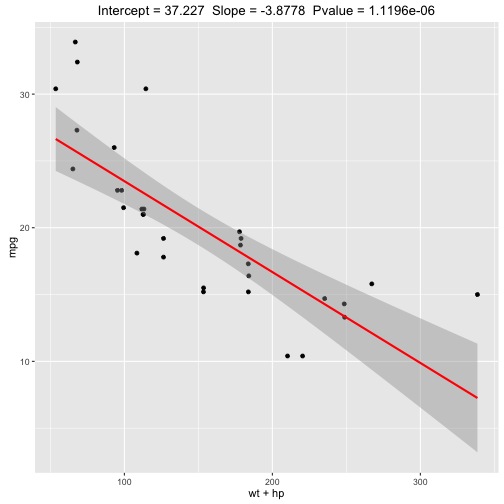

## Coefficient Chooser for mtcars

How many times has this happened to you...

You wanted to compare different combinations of mtcars coefficients
but did not want to spend your day re-computing the linear models or
re-drawing the plots.


Well...your solution is here


--- .class #id 

## The mtcars coefficient chooser is now available

1. Pick any combination of coeffiencents to predict mpg
2. Watch the plot and computations update with every change to the checkboxes
3. Determine the best combination of coefficients
4. Amaze your friends and fool your enemies with your data science skills

--- .class #id 

## How is works

The coefficient chooser uses Shiny to build the dynamic user interface, compute the linear model and
plot the results

The real magic is the conversion of the list of selected checkboxes into the '+' separated list syntax for the coefficients for the linear model:  lm(mpg ~ [checkbox list])


```r
inputList <- reactive({req(input$id1)
                        paste(input$id1,collapse="+")})
```

---

## To generate charts like this


